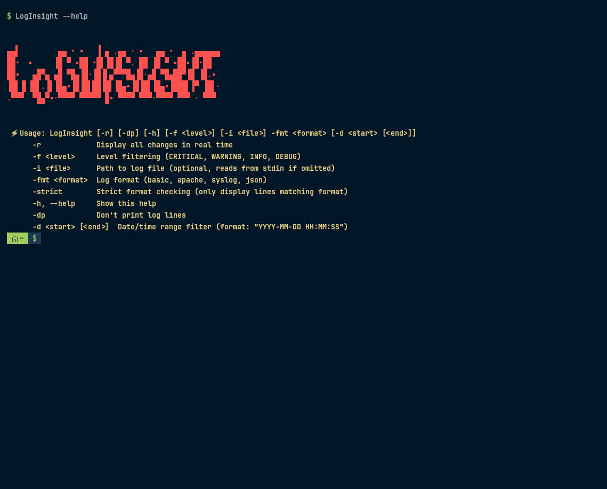
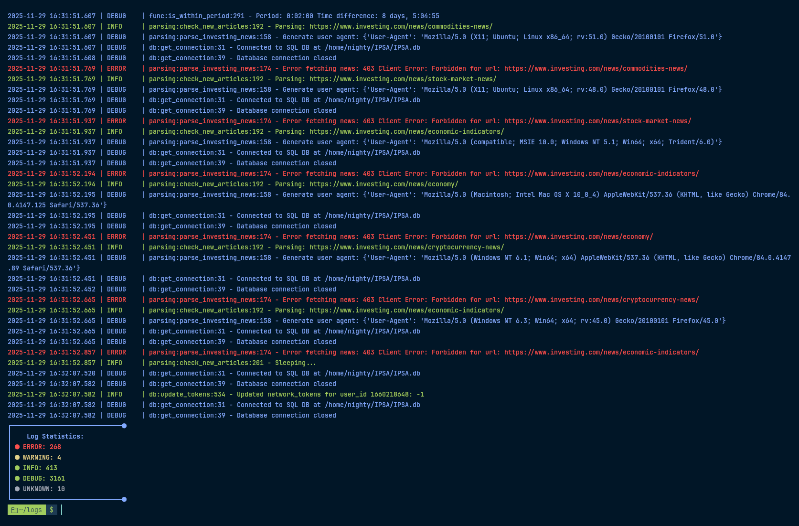
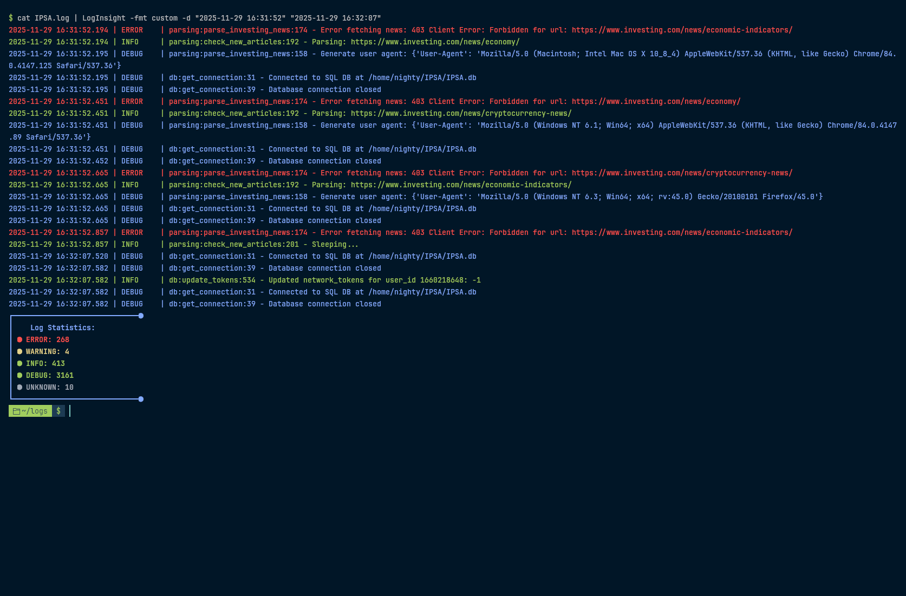
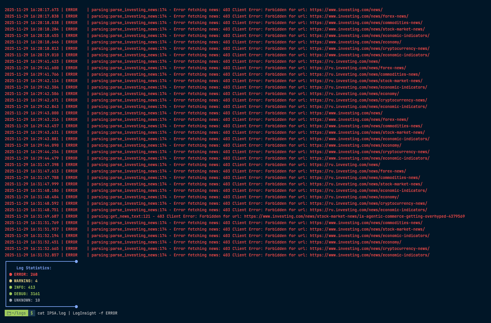

<div align="center">

# 🚦 LogInsight



### A powerful, intuitive tool for log analysis and anomaly detection

LogInsight empowers developers and system administrators to monitor, filter, and analyze logs with ease. Whether you're debugging applications or tracking system performance, LogInsight provides real-time insights with a user-friendly interface.

<br>
<a href="./LICENSE.md"></a>


<br><br>
<a href="https://github.com/DXS-GROUP/LogInsight/tree/InDev"><kbd> <br>Development Version<br> </kbd></a>

</div>

---

## 🚀 Getting Started

Get up and running with LogInsight in just a few steps:

```bash
git clone https://github.com/Nighty3098/LogInsight
cd LogInsight
make
sudo ln -s $(pwd)/LogInsight /usr/local/bin/
LogInsight
```

---

## 📖 Command-Line Usage

LogInsight offers a flexible CLI to suit your log analysis needs:

```bash
LogInsight [-r] [-dp] [-h] [-f <level>] -i <file> -fmt <format> [-d <start_date> [<end_date>]] [-strict]
```

### Options

| Option              | Description                                                                 |
|---------------------|-----------------------------------------------------------------------------|
| `-i <file>`         | Specify the path to the log file.                                          |
| `-f <level>`        | Filter logs by level (e.g., CRITICAL, WARNING, INFO, DEBUG).               |
| `-r`                | Enable real-time monitoring of log changes.                                |
| `-fmt <format>`     | Set log format (e.g., basic, apache, syslog, json).                        |
| `-d <start> [end]`  | Filter logs by date/time range (format: `YYYY-MM-DD HH:MM:SS`).            |
| `-strict`           | Display only lines strictly matching the specified format.                 |
| `-dp`               | Suppress printing of log lines (useful for stats-only output).             |
| `-h, --help`        | Display the help menu.                                                    |

---

## ✨ Key Features

- **Real-Time Monitoring**: View new log entries as they are written to the file.
- **Log Level Filtering**: Focus on specific log levels like ERROR, WARNING, or INFO.
- **Date/Time Filtering**: Narrow down logs to a specific time range.
- **Multi-Format Support**: Parse logs in basic, Apache, syslog, or JSON formats.
- **Color-Coded Output**: 
  - **Red** for ERROR logs
  - **Green** for SUCCESS logs
  - Default color for others
- **Detailed Statistics**: Summarize log levels (e.g., count of CRITICAL, ERROR, etc.).
- **File Size Insights**: View log file size in a human-readable format.
- **Strict Format Mode**: Filter out non-compliant log lines.
- **Performance Metrics**: Optionally display CPU, memory, and elapsed time for analysis.
- **Script-Friendly**: Easily integrate into scripts and automation pipelines.
- **Cross-Platform**: Optimized for Linux and POSIX-compliant environments.

---

## 💡 Example Commands

Analyze logs with precision using these examples:

```bash
# Filter logs for a specific time range
LogInsight -i /var/log/app.log -d "2025-03-12 15:18:06" "2025-03-12 15:18:09"

# Display only ERROR logs
LogInsight -i /var/log/app.log -f ERROR

# Monitor WARNING and CRITICAL logs in real time
LogInsight -i /var/log/app.log -f WARNING -f CRITICAL -r

# Enforce strict format parsing
LogInsight -i /var/log/app.log -fmt basic -strict
```

---

## 🎨 Visual Output

LogInsight enhances readability with color-coded logs:

- **ERROR**: Highlighted in **red** for quick identification.
- **SUCCESS**: Displayed in **green** to confirm successful operations.
- Other logs remain in the default color for clarity.

<div align="center">
  
  
  
</div>

---

## 🛡️ License

LogInsight is proudly licensed under the [MIT License](./LICENSE.md).

---

<div align="center">

**LogInsight** — Your go-to solution for fast, reliable log analysis and anomaly detection.

</div>
