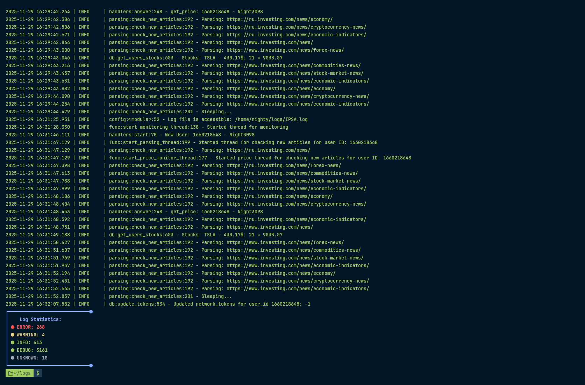

<div align="center">

# 🚦 LogInsight


### Powerful tool for log analysis and anomaly detection in your applications

<br>
<a href="./LICENSE.md"></a>


<br>


<a href="https://github.com/DXS-GROUP/LogInsight/tree/InDev"><kbd> <br>DEV VERSION<br> </kbd></a>

---

## 🚀 Quick Start

```bash
git clone https://github.com/Nighty3098/LogInsight
cd LogInsight
make
sudo ln LogInsight /bin/
LogInsight
```

---

## 📖 Usage

```bash
LogInsight [-r] [-dp] [-h] [-f <level>] -i <file> -fmt <format> [-d <start_date> [<end_date>]] [-strict]
```

| Flag                | Description                                                                                 |
|---------------------|--------------------------------------------------------------------------------------------|
| `-i <file>`         | Path to the log file                                                                       |
| `-f <level>`        | Filter by log level (CRITICAL, WARNING, INFO, DEBUG, etc.)                                 |
| `-r`                | Display all changes in real time                                                           |
| `-fmt <format>`     | Log format (basic, apache, syslog, json)                                                   |
| `-d <start> [end]`  | Filter logs by date/time (format: `YYYY-MM-DD HH:MM:SS`), you can specify a range          |
| `-strict`           | Strict format checking (show only lines matching the format)                               |
| `-dp`               | Do not print log lines                                                                     |
| `-h, --help`        | Show this help                                                                             |

---

## ✨ Features

- **Real-time log monitoring**: Instantly see new log entries as they appear in the file.
- **Flexible log level filtering**: Show only the log levels you care about (e.g., ERROR, WARNING, INFO, DEBUG, etc.).
- **Date/time filtering**: Display logs for a specific period or between two timestamps.
- **Multi-format support**: Parse logs in various formats: basic, Apache, syslog, JSON.
- **Colorful visualization**: Errors (`ERROR`) are highlighted in **red**, successful operations (`SUCCESS`) in **green**, and other lines in default color for easy scanning.
- **Statistics**: Get a summary of log levels (counts for CRITICAL, ERROR, WARNING, INFO, etc.).
- **File size reporting**: See the size of your log file in a human-readable format.
- **Strict format mode**: Only display lines that strictly match the selected log format.
- **Resource usage stats**: Optionally display elapsed time, memory, and CPU usage for log analysis.
- **Easy integration**: Simple CLI interface, can be used in scripts and pipelines.
- **Cross-platform**: Designed for Linux, works in any POSIX environment.

---

## 💡 Example Commands

```bash
# Analyze logs for a specific period
LogInsight -i /var/log/app.log -d "2025-03-12 15:18:06" "2025-03-12 15:18:09"

# Show only errors
LogInsight -i /var/log/app.log -f ERROR

# Real-time monitoring for WARNING and CRITICAL
LogInsight -i /var/log/app.log -f WARNING -f CRITICAL -r

# Use strict format mode
LogInsight -i /var/log/app.log -fmt basic -strict
```

---

## 🎨 Visualization

- Errors (`ERROR`) are highlighted in **red**
- Successes (`SUCCESS`) are highlighted in **green**
- All other lines are shown in the default color




---

## 🛡️ License

This project is licensed under the [MIT License](./LICENSE.md).

---

**LogInsight** — your fast and convenient way to analyze logs and detect anomalies!

</div>
